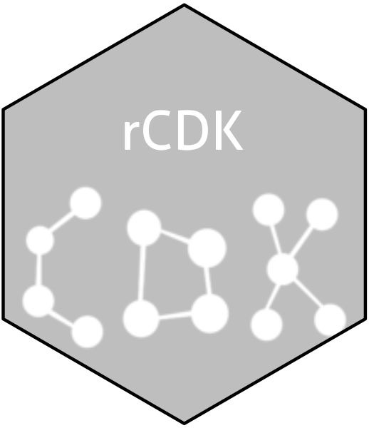

<!-- README.md is generated from README.Rmd. Please edit that file -->

```{r, echo = FALSE}
knitr::opts_chunk$set(
  collapse = TRUE,
  comment = "#>",
  fig.path = "man/figures/"
)
```

# rcdk 

<!-- badges: start -->
[](https://cran.r-project.org/package=rcdk){.rcdk-release}
[](https://github.com/CDK-R/cdkr/actions){.rcdk-devel}
[](https://app.codecov.io/gh/CDK-R/cdkr?branch=main)
<!-- badges: end -->

pkgdown is designed to make it quick and easy to build a website for your package. You can see pkgdown in action at <https://pkgdown.r-lib.org>: this is the output of pkgdown applied to the latest version of pkgdown. Learn more in `vignette("pkgdown")` or `?build_site`.

## Installation

::: .rcdk-release
```{r, eval = FALSE}
# Install released version from CRAN
install.packages("rcdk")
```
:::

::: .rcdk-devel
```{r, eval = FALSE}
# Install development version from GitHub
# install.packages("pak")
pak::pak("r-lib/rcdk")
```
:::

## Usage

Get started with [usethis](https://usethis.r-lib.org/):

```{r, eval = FALSE}
# Run once to configure your package to use pkgdown
usethis::use_pkgdown()
```

Then use pkgdown to build your website:

```{r, eval = FALSE}
pkgdown::build_site()
```

This generates a `docs/` directory containing a website. Your `README.md` becomes the homepage, documentation in `man/` generates a function reference, and vignettes will be rendered into `articles/`. Read `vignette("pkgdown")` for more details, and to learn how to deploy your site to GitHub pages.


