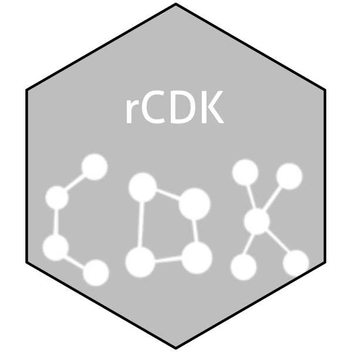

<!-- README.md is generated from README.Rmd. Please edit that file -->

```{r, echo = FALSE}
knitr::opts_chunk$set(
  collapse = TRUE,
  comment = "#>",
  fig.path = "man/figures/"
)
```

# rcdk 

<!-- badges: start -->
[](https://cran.r-project.org/package=rcdk){.rcdk-release}
[](https://github.com/CDK-R/cdkr/actions){.rcdk-devel}
[](https://app.codecov.io/gh/CDK-R/cdkr?branch=main)
<!-- badges: end -->

Allows the user to access functionality in the `CDK`, a Java framework for chemoinformatics. This allows the user to load molecules, evaluate fingerprints, calculate molecular descriptors and so on. In addition, the 'CDK' API allows the user to view structures in 2D.


## Installation

::: .rcdk-release
```{r, eval = FALSE}
# Install released version from CRAN
install.packages("rcdk")
```
:::


